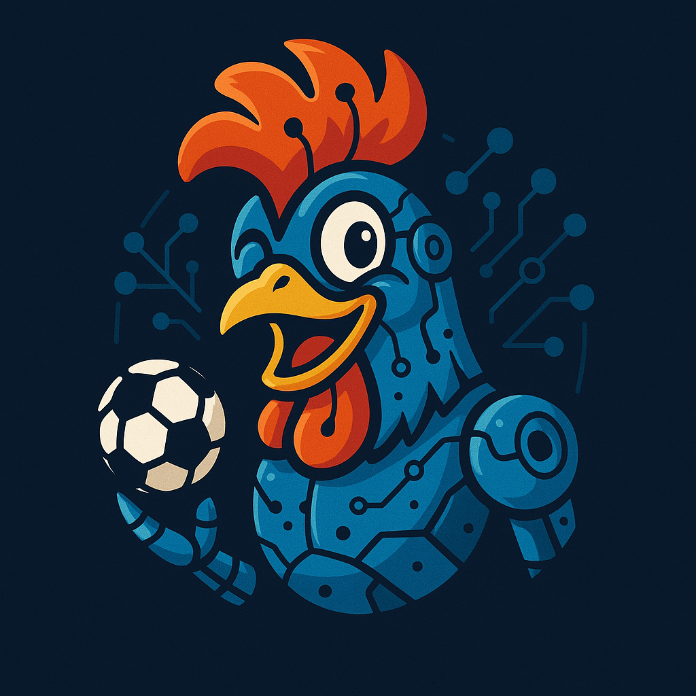

<div align="center">
    
</div>

# 🐓 Footix: Smart Sports Analysis & Prediction Toolkit

[Features](#-features) • [Installation](#-installation) • [Quick Start](#-quick-start)

## 🎮 Overview

Footix is your intelligent companion for sports analysis and prediction. Leveraging advanced machine learning algorithms and comprehensive data analysis, it helps you make data-driven decisions in sports betting and analysis.

## ✨ Features

- 📊 **Advanced Data Analysis**
  - Import data from multiple sports databases
  - Clean and preprocess sports statistics
  - Comprehensive historical data analysis

- 🤖 **Smart Prediction Engine**
  - Machine learning-powered outcome prediction

- 💰 **Strategic Betting Tools**
  - Risk assessment algorithms
  - Bankroll management system
  - Multiple betting strategy templates

## 🚀 Installation

Install Footix with pip:

```bash
pip install pyfootix
```

## 🎯 Quick Start

```python
from footix.models.bayesian import BayesianModel
from footix.data_io.footballdata import ScrapFootballData


# Load match data (example: Ligue 1 fixtures)
dataset = ScrapFootballData(competition="FRA Ligue 1", season="2024-2025", path ="./data", force_reload=True).get_fixtures()

# Initialize and fit the Bayesian model
model = BayesianModel(n_teams=18, n_goals=20)
model.fit(X_train=dataset)

# Predict probabilities for a specific match
probas = model.predict(home_team="Marseille", away_team="Lyon").return_probas()
print(f"Home: {probas[0]:.2f}, Draw: {probas[1]:.2f}, Away: {probas[2]:.2f}")
```

## 📤 Exporting Predictions

You can export Bayesian predictions to JSON using:

- Core Python utilities for script/automation workflows

See the full tutorial in [docs/source/prediction_export_tutorial.rst](docs/source/prediction_export_tutorial.rst).

## 📝 License

This project is licensed under the MIT License - see the [LICENSE](LICENSE) file for details.

## 🤝 Contributing

Contributions are welcome! Please feel free to submit a Pull Request. For major changes, please open an issue first to discuss what you would like to change.
